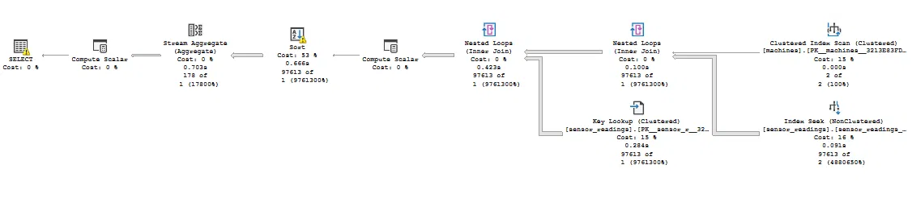

# Sistem Monitoring Mesin Berbasis IoT

Aplikasi monitoring mesin produksi berbasis sensor IoT (simulasi), mencakup manajemen data mesin, penerimaan data sensor real-time via API, dashboard monitoring live, deteksi otomatis kebutuhan maintenance, dan rekap output produksi.

## 1. Tech Stack & Alasan Pemilihan

| Komponen | Pilihan | Alasan |
|---|---|---|
| Backend | Laravel 13 (PHP 8.3) | Familiar, ekosistem lengkap (routing, validasi, ORM, migration) mempercepat development dalam waktu terbatas (7 hari) |
| Frontend | Blade + Livewire 3 | Tidak perlu API layer terpisah + frontend SPA; reactivity native cocok untuk dashboard yang butuh update berkala tanpa setup Node.js/npm yang kompleks |
| Database | Microsoft SQL Server (Express, via Laragon + SSMS) | Sesuai requirement wajib soal |
| Real-time update dashboard | Server-Sent Events (SSE) native | Alternatif WebSocket yang lebih ringan setup-nya, cukup pakai `EventSource` bawaan browser + `StreamedResponse` bawaan Laravel. |
| Web server (development) | Apache via Laragon (virtual host) | **Bukan** `php artisan serve`, dev server bawaan Laravel cuma bisa proses 1 request pada satu waktu, menyebabkan koneksi SSE menyandera request lain, sedangkan Apache mendukung request paralel |
| Autentikasi | Laravel Breeze (stack Livewire) | Starter kit resmi, cepat setup untuk login/register + fondasi role-based access |

## 2. Struktur Repository

```
iot-monitoring-system/
├── monitoring-app/ # Backend + Frontend Laravel (aplikasi utama)
├── device-simulator/ # Script standalone (bukan bagian Laravel) yang mensimulasikan device IoT eksternal
└── README.md
```

Kedua bagian ini sengaja dipisah foldernya: `device-simulator` merepresentasikan pihak eksternal (tim IoT) yang mengirim data lewat HTTP request biasa ke API, bukan bagian internal sistem.

## 3. Cara Instalasi & Menjalankan (Local)

### Prasyarat
- PHP 8.3 (Thread Safe, x64), direkomendasikan via [Laragon](https://laragon.org/)
- Composer
- Node.js + npm (dibutuhkan Breeze untuk compile asset frontend)
- SQL Server Express/Developer Edition + SSMS
- Driver PHP `sqlsrv` & `pdo_sqlsrv` (sesuai versi PHP, lihat [Microsoft Docs](https://learn.microsoft.com/en-us/sql/connect/php/download-drivers-php-sql-server))
- ODBC Driver 17/18 for SQL Server

### Langkah Setup

```bash
# 1. Clone repo
git clone <url-repo>
cd iot-monitoring-system/monitoring-app

# 2. Install dependency
composer install
npm install && npm run build

# 3. Konfigurasi environment
cp .env.example .env
php artisan key:generate
```

Edit `.env`, sesuaikan koneksi database:

```
DB_CONNECTION=sqlsrv
DB_HOST=localhost
DB_PORT=1433
DB_DATABASE=iot_monitoring
DB_USERNAME=<username SQL Server>
DB_PASSWORD=<password>

IOT_API_KEY=secret-iot-key-2026
MAINTENANCE_OFF_THRESHOLD_MINUTES=10
```

```bash
# 4. Migrasi database
php artisan migrate

# 5. (Opsional) Seed akun default
php artisan db:seed
```

> **Akun default setelah seeding:**
> - Admin: `admin@example.com` / `password`
> - Viewer: `viewer@example.com` / `password`

### Menjalankan Aplikasi

**Disarankan pakai Apache (Laragon virtual host)**, bukan `php artisan serve`, karena dashboard memakai koneksi SSE long-lived yang butuh server yang bisa menangani request paralel (lihat bagian Kendala untuk detail).

1. Set virtual host via Laragon (Auto Create Virtual Host pada folder `monitoring-app`), atau arahkan document root manual ke folder `monitoring-app/public`
2. Buka `http://monitoring-app.test` (atau domain virtual host yang dibuat)

**Jalankan device simulator** (terminal terpisah):
```bash
cd device-simulator
php simulate.php
```
Sesuaikan `$apiUrl` di dalam `simulate.php` dengan domain virtual host yang kamu pakai.

**Generate data historis (opsional, untuk uji performa skala besar)**:
```bash
cd monitoring-app
php artisan generate:sensor-history --rows=100000 --days=90
```

## 4. Diagram ER Database


**Tabel utama:**
- `machines`: kode, nama, lokasi, tipe, tanggal instalasi, status aktif
- `sensors`: minimal 1 per mesin, punya `metric_type` (temperature/rpm)
- `sensor_readings`: status ON/OFF, nilai metrik, output, timestamp. **Unique constraint** pada `(sensor_id, recorded_at)` untuk mencegah duplikat
- `users`: kolom `role` (enum: admin/viewer)

## 5. Fitur & Role Access

| Fitur | Admin | Viewer |
|---|---|---|
| CRUD Mesin | ✅ | ❌ (hanya lihat) |
| Dashboard Monitoring | ✅ | ✅ |
| Rekap Output | ✅ | ✅ |

## 6. Endpoint API Sensor Data

`POST /api/sensor-data`

**Autentikasi**: header `X-API-KEY: <sama dengan IOT_API_KEY di .env>`. Menggunakan API key statis (bukan Sanctum/session) karena device IoT tidak memiliki sesi login, pendekatan umum untuk autentikasi service-to-service yang sederhana.

**Payload:**
```json
{
  "machine_code": "MSN-001",
  "sensor_code": "MSN-001-TEMP",
  "status": "ON",
  "metric_value": 65.5,
  "output_qty": 10,
  "recorded_at": "2026-08-21 10:00:00"
}
```

**Validasi**: field wajib, `status` harus ON/OFF, `machine_code` harus terdaftar → response `422` jika gagal.

**Penanganan data tidak ideal, Duplikat**: kombinasi `(sensor_id, recorded_at)` dibatasi unique constraint di level database. Jika device mengirim data yang sama persis 2x, sistem menolak dengan response `409 Conflict`.

## 7. Device Simulator

Script standalone (`device-simulator/simulate.php`) mensimulasikan device IoT eksternal, berjalan independen dari aplikasi utama, mengirim data lewat HTTP request (cURL) ke endpoint di atas setiap ~7 detik per mesin.

## 8. Dashboard Real-Time

Menggunakan **Server-Sent Events (SSE)**, endpoint `/dashboard/stream` melakukan streaming update status mesin setiap 3 detik, dikonsumsi browser lewat `EventSource` native (tanpa library tambahan). Koneksi otomatis ditutup tiap ~25 detik dan browser reconnect otomatis, untuk mencegah 1 koneksi menyandera resource server dalam waktu lama.

## 9. Aturan "Perlu Maintenance"

**Logika yang diimplementasikan**: mesin ditandai "perlu maintenance" jika **tidak ada laporan status ON dalam X menit terakhir** (default 10 menit, dikonfigurasi lewat `.env`: `MAINTENANCE_OFF_THRESHOLD_MINUTES`).

**Kenapa aturan ini (bukan yang lain)**: dipilih karena paling mudah diverifikasi datanya secara objektif dari data sensor yang ada, dan langsung merepresentasikan "downtime tidak terjadwal", indikator paling actionable untuk tim maintenance.

**Asumsi**: karena tidak ada konsep "jadwal maintenance terencana" di scope tes ini, SETIAP kondisi OFF berkepanjangan dianggap "tidak terjadwal". Di sistem produksi nyata, ini idealnya dibedakan dengan jadwal maintenance resmi yang di-input terpisah.

## 10. Rekap Output Produksi

Filter: rentang tanggal, dikelompokkan per Hari/Shift/Bulan, per mesin.

**Definisi shift** : Shift 1 (06:00-14:00), Shift 2 (14:00-22:00), Shift 3 (22:00-06:00).

**Perhitungan uptime%**: proporsi jumlah baris data berstatus ON dibanding total baris data pada periode tersebut. Karena data dikirim periodik dengan interval konsisten, proporsi ini merepresentasikan estimasi uptime yang cukup akurat.

**Rata-rata output/jam**: total output dibagi estimasi jumlah jam pada periode pengelompokan (24 jam untuk grouping harian, 8 jam untuk shift, ~720 jam untuk bulanan), nilai ini estimasi, bukan hitungan jam operasional aktual per mesin.

## 11. Strategi Skalabilitas & Optimasi

### Generate Data Historis
`php artisan generate:sensor-history --rows=100000 --days=90` menghasilkan **100.000 baris dalam 71.41 detik**, menggunakan bulk insert (`DB::table()->insert()`) dengan **batch size 200 baris** per query.

> **Catatan teknis **: SQL Server membatasi maksimal ~2100 parameter per query. Karena tabel `sensor_readings` punya 7 kolom, batch size  dibatasi ≤300 baris (dipakai 200 untuk margin aman).

### Index yang Diterapkan
- `(machine_id, status, recorded_at)`, composite index untuk query deteksi maintenance
- `(machine_id, recorded_at) INCLUDE (status, output_qty)` — **covering index**, mengeliminasi "Key Lookup" pada query rekap output (kolom yang dibutuhkan query langsung tersedia di index, tidak perlu balik baca ke tabel utama)

### Analisis Execution Plan (Query Rekap Output, 97.613 baris)

**Sebelum optimasi**: ditemukan operator `Key Lookup` dengan cost 15%, terjadi karena index yang dipakai belum menyertakan kolom `status` dan `output_qty` yang dibutuhkan query, sehingga SQL Server harus membaca ulang tabel utama untuk tiap baris hasil.

**Setelah optimasi**: index diperluas jadi covering index, `Key Lookup` hilang dari execution plan.

**Sebelum optimasi** (Elapsed: 890ms, terdapat Key Lookup 15% cost): ![Execution Plan Sebelum] 

**Sesudah optimasi** (Elapsed: 474ms, Key Lookup hilang — ~47% lebih cepat): 


## 12. Kendala yang Dihadapi & Cara Mengatasi

1. **SQL Server tidak menerima koneksi TCP**, TCP/IP di SQL Server Configuration Manager default nonaktif, dan instance bernama (`SQLEXPRESS`) pakai port dinamis. Solusi: aktifkan TCP/IP, set port statis 1433, buka port di Windows Firewall, aktifkan SQL Server Browser service.
2. **Foreign key cascade path conflict**, SQL Server menolak 2 jalur `CASCADE DELETE` menuju tabel yang sama (`machines → sensor_readings` langsung dan lewat `sensors`). Solusi: salah satu FK diubah jadi `NO ACTION` (bukan `RESTRICT` — keyword ini tidak dikenali dialek SQL Server, beda dengan MySQL/PostgreSQL).
3. **Composer case-sensitive namespace**, meski Windows case-insensitive untuk nama file, autoloader Composer tetap case-sensitive saat mencocokkan namespace PHP, menyebabkan error "Class not found" walau file secara fisik ada.
4. **`php artisan serve` sebagai bottleneck concurrency**, dev server bawaan hanya memproses 1 request per waktu (khususnya di Windows tanpa dukungan multi-worker). Koneksi SSE dashboard yang long-lived menyandera satu-satunya worker, membuat request lain antre hingga puluhan detik/menit. Solusi: pindah ke Apache lewat virtual host Laragon, load time turun dari ~30 detik menjadi ~2.5 detik untuk dataset 100rb+ baris.
5. **SQL Server parameter limit saat bulk insert**, batch insert 1000 baris/query gagal karena melebihi batas ~2100 parameter SQL Server. Solusi: turunkan batch size ke 200 baris/query.

## 13. Asumsi Tambahan

- Setiap mesin baru otomatis dibuatkan 1 sensor default (`metric_type: temperature`) saat dibuat lewat CRUD, memenuhi requirement "minimal 1 sensor virtual per mesin" tanpa perlu form terpisah.
- Autentikasi API sensor data memakai API key statis tunggal untuk semua device, bukan token per-device.
- Kolom `role` di tabel `users` menggunakan enum sederhana (`admin`/`viewer`) tanpa tabel `roles`/`permissions` terpisah, karena hanya dibutuhkan 2 role tetap.